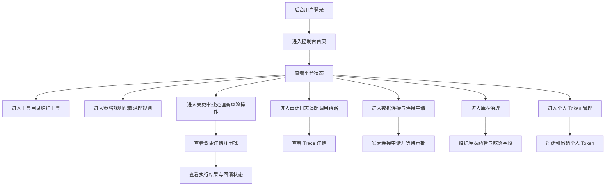

## 1. 产品概述

GateMind UI 是企业 MCP 网关与工具治理平台的后台管理界面，服务于平台管理员、业务负责人、审批人和审计人员。  
目标是把工具目录、风险策略、审批流和审计日志可视化，形成可操作、可追踪、可治理的企业 AI 管理台。

- 解决企业 AI 调用工具时的可见性、可控性、可审批性、可审计性问题
- 为后续 Go 网关后端提供稳定的后台操作入口与治理界面

## 2. 核心功能

### 2.1 用户角色

| 角色 | 进入方式 | 核心权限 |
|------|----------|----------|
| 平台管理员 | 内部账号登录 | 管理工具、策略、审批模板、业务域、查看全局审计 |
| 业务负责人 | 内部账号登录 | 审批高风险变更、查看本业务域工具与调用数据 |
| 审批人 | 内部账号登录 | 查看并处理待审批变更单 |
| 审计人员 | 内部账号登录 | 查看全量审计日志与调用链路 |
| 普通运营用户 | 内部账号登录 | 查看与自己相关的调用记录、确认轻量变更 |

### 2.2 功能模块

1. **控制台首页**：平台概览、待办审批、风险分布、异常调用、热门工具
2. **工具目录页**：工具列表、检索筛选、工具详情、版本信息、状态管理
3. **策略规则页**：策略列表、风险限制、角色权限、审批模板绑定
4. **变更审批页**：待审批列表、变更单详情、审批操作、执行状态
5. **审计日志页**：调用记录检索、链路详情、策略命中、快照查看
6. **业务域页**：业务域总览、域内工具、负责人、Provider 状态
7. **数据连接页**：连接列表、状态管理、环境信息、连接测试
8. **功能发布页**：基于连接和库表发布功能，填写用途说明、执行范围、业务域，并在发布时自动更新版本号
9. **库表治理页**：库表清单、敏感字段标记、增删操作入口、纳管状态
10. **个人 Token 页**：Token 列表、创建 Token、权限范围、过期时间、吊销

### 2.3 页面详情

| 页面名称 | 模块名称 | 功能描述 |
|----------|----------|----------|
| 控制台首页 | 平台概览卡片 | 展示今日调用量、审批量、拒绝量、异常量 |
| 控制台首页 | 风险分布图 | 按 Level 0-4 展示调用分布 |
| 控制台首页 | 待审批列表 | 展示高优先级待审批变更单并可快捷进入详情 |
| 工具目录页 | 工具列表 | 支持名称、业务域、风险等级、状态筛选 |
| 工具目录页 | 工具详情抽屉 | 展示 schema、风险信息、负责人、版本、暴露规则 |
| 策略规则页 | 策略列表 | 展示策略名称、优先级、适用角色、审批模板 |
| 策略规则页 | 策略编辑面板 | 支持配置风控规则、脱敏规则、审批要求 |
| 变更审批页 | 变更单列表 | 支持按状态、风险等级、业务域筛选 |
| 变更审批页 | 变更详情 | 展示发起人、目标动作、风险、影响范围、回滚方式 |
| 变更审批页 | 审批操作区 | 支持通过、驳回、查看执行与回滚状态 |
| 审计日志页 | 日志筛选器 | 支持按用户、工具、业务域、时间范围筛选 |
| 审计日志页 | Trace 详情 | 展示请求、策略、审批、执行全链路快照 |
| 业务域页 | 域卡片区 | 展示各业务域状态、工具数量、负责人 |
| 业务域页 | Provider 状态 | 展示连接健康度与最近调用情况 |
| 数据连接页 | 连接列表 | 展示连接名称、环境、驱动、状态、负责人 |
| 数据连接页 | 连接详情 | 展示用途说明、库表数量、最近测试结果、审批来源 |
| 数据连接页 | 通用频率设置 | 配置连接级调用频率、并发限制、冷却策略 |
| 数据连接页 | 默认数据量设置 | 配置默认返回条数、分页上限、最大导出量 |
| 功能发布页 | 功能表单 | 填写功能名称、依赖连接、用途、业务域、执行范围和待发布版本 |
| 功能发布页 | 发布记录 | 展示发布状态、审批链路、驳回原因 |
| 库表治理页 | 库表列表 | 以展示库、表、字段数、预估数据量为主，并附带纳管状态 |
| 库表治理页 | 库表详情面板 | 展示所属连接、负责人、字段数、预估行数和当前可用动作 |
| 个人 Token 页 | Token 列表 | 展示名称、作用范围、过期时间、最后使用时间 |
| 个人 Token 页 | 创建 Token 面板 | 支持生成个人访问 Token、复制、立即吊销 |
| 个人 Token 页 | 独立请求频率设置 | 配置 Token 级每分钟请求数、突发阈值、超限策略 |
| 个人 Token 页 | 默认数据量覆盖 | 配置该 Token 独立的默认查询量和最大请求量 |

## 3. 核心流程

后台用户的核心使用流程分为七类：

1. 平台管理员进入首页查看整体运行状态，随后进入工具目录维护工具元数据和风险等级。
2. 管理员或负责人在策略规则页配置允许调用范围、确认规则和审批要求。
3. 审批人进入变更审批页处理高风险变更单，并在详情页查看风险和影响范围后决定通过或驳回。
4. 审计人员进入审计日志页检索某次调用的完整链路，确认是谁发起、命中了什么策略、是否经过审批、执行前后发生了什么。
5. 平台管理员在数据连接页查看数据库连接状态，并通过连接申请流程审批新接入的数据源。
6. 数据治理人员在库表治理页查看连接下的数据库资产，维护纳管状态、敏感字段和增删入口。
7. 个人用户在个人 Token 页创建自己的访问 Token，用于脚本、CLI 或外部系统安全调用 GateMind。

## 4. 用户界面设计

### 4.1 设计风格

- 主色：深石墨蓝、冷灰黑
- 强调色：荧光青、信号橙
- 风格方向：企业风控中台 + 指挥舱 + 轻微未来感
- 按钮样式：大圆角矩形，重点按钮使用高对比渐变描边
- 字体建议：标题使用有识别度的衬线或半衬线展示字体，正文使用易读的现代无衬线字体
- 布局风格：桌面优先，左侧导航 + 顶部状态栏 + 内容仪表区
- 图标风格：线性图标，保持克制，搭配少量发光状态点
- 动效建议：数据卡片缓入、图表轻微浮动、悬停高亮、抽屉侧滑

### 4.2 页面设计概览

| 页面名称 | 模块名称 | UI 元素 |
|----------|----------|----------|
| 控制台首页 | 指标卡片区 | 深色卡片、发光边线、数字滚动动画、风险色标签 |
| 控制台首页 | 风险图表区 | 柱状图/环形图、半透明面板、弱网格背景 |
| 工具目录页 | 工具表格 | 粗细分层字体、状态徽标、风险等级彩色标签、右侧详情抽屉 |
| 策略规则页 | 策略卡片 | 分区表单、条件标签、审批模板胶囊标签 |
| 变更审批页 | 变更列表 | 时间轴 + 风险高亮 + 审批状态条 |
| 变更审批页 | 详情面板 | 风险摘要卡、影响范围区、审批操作按钮组 |
| 审计日志页 | Trace 详情 | 分段时间线、JSON 片段预览块、过滤器工具条 |
| 业务域页 | 域总览卡片 | 网格布局、健康状态灯、工具数量统计、负责人信息 |
| 数据连接页 | 连接状态面板 | 深色状态卡、环境标签、数据库驱动标识、测试结果 |
| 连接申请页 | 申请表单 | 双列表单、审批说明卡、权限范围标签、提交按钮 |
| 库表治理页 | 库表清单 | 多列数据表、敏感字段标签、纳管状态徽标、操作栏 |
| 个人 Token 页 | Token 安全卡 | 遮罩显示 Token、复制按钮、到期标签、吊销动作 |

### 4.3 响应式策略

- 默认采用桌面优先设计
- 宽屏下使用三段式内容布局，突出控制台感
- 平板宽度下降级为双列布局
- 手机端保留核心查看能力，但以信息折叠为主，不优先复杂操作

### 4.4 视觉记忆点

- 首页顶部做“企业 AI 治理指挥舱”风格的品牌区
- 核心指标卡结合发光描边和噪点背景，形成差异化识别
- 风险等级采用统一视觉编码，让 `Level 0-4` 一眼可识别
- Trace 详情页采用链路时间线布局，强化“可追踪、可追责”的产品特征
