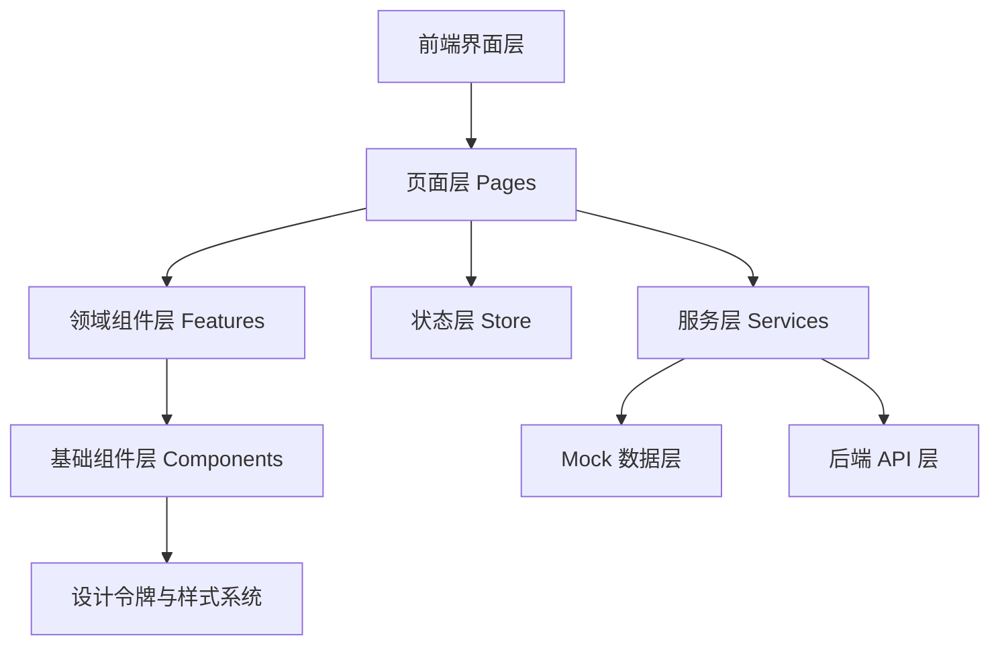

## 1. 架构设计



UI 第一阶段采用纯前端实现，先完成后台管理台界面和交互骨架，数据默认由本地 Mock 驱动，后续再平滑替换成 Go 后端 API。

高可维护性原则：

- 页面只负责布局和组装，不承载复杂业务逻辑
- 领域组件按业务模块拆分，不做超大一体组件
- 通用样式通过设计令牌统一管理
- 状态管理只存共享状态，本地展示状态留在组件内部
- 所有模拟数据经过服务层，避免页面直接依赖静态文件

## 2. 技术说明

- 前端：React 18 + TypeScript + Vite
- 路由：react-router-dom
- 样式：Tailwind CSS 3
- 状态管理：Zustand
- 图标：lucide-react
- 图表：优先使用轻量 SVG/自绘组件，避免初期引入重型图表库
- 数据来源：Mock Service，本地 JSON/TS 数据对象封装为 service
- 测试：Vitest + React Testing Library

选型理由：

- React + TypeScript 适合构建模块化后台系统
- Tailwind 方便快速建立统一设计系统
- Zustand 足够轻，避免过早引入复杂状态框架
- 先用 Mock Service 可以让 UI 与后端并行开发，同时保持接口边界清晰

## 3. 路由定义

| 路由 | 用途 |
|------|------|
| `/` | 控制台首页 |
| `/tools` | 工具目录页 |
| `/policies` | 策略规则页 |
| `/approvals` | 变更审批页 |
| `/audit` | 审计日志页 |
| `/domains` | 业务域管理页 |

## 4. API 定义

第一阶段 UI 先使用前端本地 service 接口，接口结构按未来 Go 后端形式设计。

### 4.1 TypeScript 类型定义

```ts
export type RiskLevel = 0 | 1 | 2 | 3 | 4;

export interface ToolSummary {
  id: string;
  name: string;
  domain: string;
  system: string;
  riskLevel: RiskLevel;
  status: "active" | "draft" | "disabled";
  owner: string;
  updatedAt: string;
}

export interface PolicySummary {
  id: string;
  name: string;
  priority: number;
  scope: string;
  effect: "allow" | "confirm" | "approval_required" | "deny";
  enabled: boolean;
}

export interface ApprovalItem {
  id: string;
  title: string;
  requester: string;
  domain: string;
  riskLevel: RiskLevel;
  status: "pending" | "approved" | "rejected" | "executed";
  createdAt: string;
}

export interface AuditEvent {
  id: string;
  traceId: string;
  actor: string;
  toolName: string;
  domain: string;
  decision: string;
  createdAt: string;
}
```

### 4.2 未来接口映射

| 接口 | 说明 |
|------|------|
| `GET /api/dashboard/summary` | 获取首页概览数据 |
| `GET /api/tools` | 获取工具列表 |
| `GET /api/tools/:id` | 获取工具详情 |
| `GET /api/policies` | 获取策略列表 |
| `GET /api/change-requests` | 获取变更单列表 |
| `GET /api/change-requests/:id` | 获取变更单详情 |
| `GET /api/audit/events` | 获取审计日志列表 |
| `GET /api/domains` | 获取业务域信息 |

## 5. 页面与组件架构

### 5.1 页面层职责

页面目录建议：

```text
src/pages/
  DashboardPage.tsx
  ToolsPage.tsx
  PoliciesPage.tsx
  ApprovalsPage.tsx
  AuditPage.tsx
  DomainsPage.tsx
```

页面层原则：

- 页面负责路由入口和布局拼装
- 页面只调用 hooks 或 services 获取数据
- 页面不直接硬编码复杂视觉区块

### 5.2 领域组件拆分

组件目录建议：

```text
src/components/
  shell/
    AppSidebar.tsx
    TopStatusBar.tsx
    PageHeader.tsx
  dashboard/
    MetricCard.tsx
    RiskDistributionPanel.tsx
    PendingApprovalList.tsx
    ToolHeatmapPanel.tsx
  tools/
    ToolTable.tsx
    ToolFilters.tsx
    ToolDetailDrawer.tsx
  policies/
    PolicyTable.tsx
    PolicyEditorPanel.tsx
  approvals/
    ApprovalTable.tsx
    ApprovalDetailPanel.tsx
  audit/
    AuditTable.tsx
    TraceTimeline.tsx
  domains/
    DomainCardGrid.tsx
    ProviderStatusPanel.tsx
  ui/
    StatusBadge.tsx
    RiskBadge.tsx
    SectionCard.tsx
    DataTable.tsx
```

拆分规则：

- 所有业务组件尽量控制在单文件 200 行以内
- 抽屉、表格、筛选器、详情面板分离
- 通用组件只解决通用视觉与交互，不耦合业务字段

## 6. 状态管理设计

共享状态只保留以下内容：

- 当前导航状态
- 全局筛选条件
- 当前选中的工具 / 变更单 / Trace
- 主题和布局偏好

建议 Store 结构：

```text
src/store/
  useShellStore.ts
  useToolStore.ts
  useApprovalStore.ts
  useAuditStore.ts
```

规则：

- 异步加载逻辑统一放在 hooks 或 services，不直接塞进组件树
- 不做一个“超级 store”承载所有页面状态
- 组件临时展开、hover、tab 切换这类状态留在组件本地

## 7. 样式系统设计

### 7.1 设计令牌

统一维护：

- 颜色变量
- 风险等级颜色
- 字号层级
- 圆角系统
- 阴影系统
- 面板背景
- 间距规范

建议结构：

```text
src/styles/
  tokens.css
  utilities.css
```

### 7.2 风险视觉规范

| 风险等级 | 颜色建议 | 含义 |
|----------|----------|------|
| Level 0 | 冷灰/青蓝 | 只读安全 |
| Level 1 | 蓝色 | 草稿生成 |
| Level 2 | 琥珀色 | 需要确认 |
| Level 3 | 橙色 | 需要审批 |
| Level 4 | 红色 | 极高风险 |

### 7.3 可维护性约束

- 颜色不允许在业务组件中到处写死
- 间距统一使用 4 的倍数
- 卡片、表格、按钮、标签使用统一基础组件
- 动效统一使用有限几套过渡参数，不在每个组件随意写

## 8. Mock 数据架构

第一阶段使用 Mock 但必须保证未来可替换：

```text
src/services/
  dashboardService.ts
  toolService.ts
  policyService.ts
  approvalService.ts
  auditService.ts
  domainService.ts

src/mocks/
  dashboard.ts
  tools.ts
  policies.ts
  approvals.ts
  audit.ts
  domains.ts
```

规则：

- 页面永远通过 `services` 获取数据
- `mocks` 只作为数据源，不直接被页面引用
- 后续切换 Go API 时，只替换 services 实现

## 9. 测试策略

- 基础页面渲染测试
- 核心组件状态切换测试
- 风险徽标、状态徽标渲染测试
- 列表筛选与详情抽屉联动测试

优先覆盖：

- 首页指标卡渲染
- 工具列表筛选逻辑
- 审批列表与详情联动
- Trace 时间线渲染

## 10. 维护性设计结论

为避免“前期能用，后期难维护”，本次 UI 实现必须遵守：

1. 页面层薄，组件层清晰。
2. 业务组件和基础组件分层。
3. Mock 与 API 经由统一 service 层隔离。
4. 设计令牌统一，不写散乱样式。
5. Store 按领域拆分，不做超级全局状态。
6. 组件小而专一，可替换、可测试、可复用。
